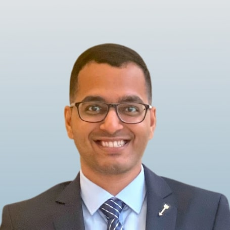
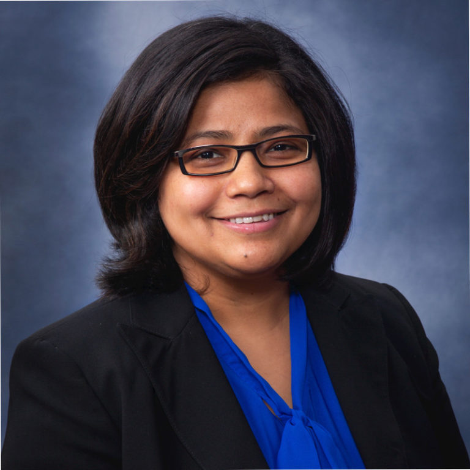

Checkout the [Lab Website](https://neuroergolab.org) for more information.

## Project Team

  

    
    <h3 style="text-align: center"><a href="https://nimrobotics.com/">Aakash Yadav</a></h3>
  

  

    
    <h3 style="text-align: center"><a>Jeevan Jayasuriya</a></h3>
  

  

    
    <h3 style="text-align: center"><a href="https://www.linkedin.com/in/jacqueline-aleman-66ab20227">Tiash Rana Mukherjee</a></h3>
  

  

    
    <h3 style="text-align: center"><a href="https://www.linkedin.com/in/aiden-nguyen-180b43205/">Tiago Guntur</a></h3>
  

  

    
    <h3 style="text-align: center"><a href="https://www.linkedin.com/in/ranjanamehta/">Ranjana K. Mehta</a></h3>
  

## Problem Statement

## Conceptualization

## Measurements

## Provide Feedback
Our team is always looking for feedback on our project.
